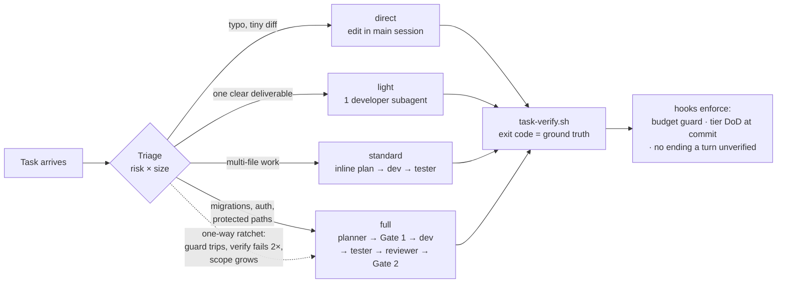

# Maestro — a tiered, gated dev harness for Claude Code

[](https://github.com/oscarlehuu/my-claude-harness/actions/workflows/tests.yml)

> Not every task deserves a team meeting. A boss doesn't convene the whole company to fix a typo —
> but he does call the lawyer before changing one line of a contract. Maestro makes Claude Code work
> the same way: **triage every task by risk × size, run only the process that tier needs, and make
> the safety rails impossible to talk your way past.**

100% native Claude Code — subagents, hooks, a skill, and a set of small shell scripts. No MCP server,
no proxy, no daemon. The whole loop runs inside the conversation where you can watch every step,
and the state lives in plain files you can `cat`.

**License:** MIT · **Status:** in daily use and team-ready — built and shipped through its own
gated loop (the task ledgers under `.claude/maestro/` are the receipts). Rolling it out to a
team is a per-machine install; see [Rolling it out to a team](#rolling-it-out-to-a-team).

---

## The idea in one diagram



The model decides the tier (it's a judgment call). The **escalation ratchet is code** — it only
goes up, never silently down. Choosing too light a tier is harmless: the moment the diff outgrows
the budget or touches a protected path, a hook blocks and the task escalates.

## Design principles

**Prose decides, scripts record, hooks enforce.** The LLM makes judgment calls (tier, plan,
handoffs). Everything that must be *exactly right* is code:

| Concern | Mechanism |
|---|---|
| Task state | A file ledger (`.claude/maestro/<slug>/state.json` + `log.jsonl`) written only by scripts — stable schema, no drift |
| "Tests passed" | `task-verify.sh` is the **only** writer of verify records: a recorded pass means the command really exited 0, not that a model claimed it did |
| Shipping discipline | `commit-gate` hook reads the active task's tier DoD from the ledger and re-runs the verify command on every `git commit` — missing tester verdict at standard tier? Commit blocked |
| Honest endings | `stop-dod` hook blocks ending a turn with code changed after the last green verify |
| Scope creep | `guard-block-main-edits`/`-bash` hooks cap direct edits at ≤50 changed lines / 2 files (cumulative vs HEAD) and hard-block protected paths — surviving even `--dangerously-skip-permissions` |
| Tier discipline | `task-record.sh` refuses tier downgrades; a new dev round invalidates stale verdicts (they judged the old diff) |

**Goal-altitude delegation.** The orchestrator (CTO) writes each crew subagent one self-contained
GOAL handoff — goal, context with `file:line` hints, deliverables, constraints, acceptance — and
owns *what*; the subagent owns *how*. The same GOAL flows to an adversarial tester as the judged
intent, so "command exited 0" and "task actually satisfied" stay separate questions.

**Edge cases become tests, not vibes.** The known failure mode of same-family dev + judges is the
rare missed special case. So the developer contract makes edge-case enumeration mandatory
(boundary / empty / concurrent / error-path / unicode / timezone …), the applicable ones must become
executable tests, and the tester is explicitly an edge-case hunter that treats a lazy edge-case
ledger as a FAIL signal on its own.

## The tier ladder

| Tier | When | What runs | Human gates |
|---|---|---|---|
| **direct** | complete diff fits in your head, ≤50 lines / 2 files, no protected path | edit in main session | none (verify still enforced at stop/commit) |
| **light** | one clear deliverable, verify command known | 1 developer subagent → verify | none |
| **standard** | multi-file feature/bugfix | inline plan (posted, then proceed) → dev → verify → tester rounds | Gate 2 (ship) |
| **full** | protected paths, migrations, auth, public API | planner subagent → **Gate 1** → dev → verify → tester → reviewer → **Gate 2**, strict DoD | Gate 1 + Gate 2 |

**Risk beats size**: a 3-line migration edit is `full`; a 200-line new test file is `light`.

## Phased mode — large handoffs become resumable phases

A project-scale task is too big for one GOAL handoff to one developer run: that's an un-resumable
monolith — if the run dies, you reconstruct. **Phased mode** (a mode of *full* tier) decomposes it
instead. The planner emits **N self-contained, independently-verifiable phases**, and `task-plan.sh`
scaffolds each as its own `phase.md` — a ready-to-dispatch GOAL handoff with `status · dependencies ·
risk` frontmatter — under `.claude/maestro/<slug>/phases/`, topo-sorted by an explicit dependency
graph (a cycle is refused, all-or-nothing — nothing half-scaffolds).

Phases dispatch one developer run at a time; each is verified and committed on the task branch. A
**two-level Definition of Done** keeps the gates honest: *phase-DoD* is just that phase's verify going
green; *plan-DoD* is every phase done **plus** the final tester + reviewer + Gate 2. The phase
checkboxes are both the progress bar and the **resume point** — done phases stay `[x]`, and work
resumes from the first pending phase whose dependencies are met, re-dispatching its own self-contained
file. A task with no phases behaves byte-for-byte as before.

## The crew

The work is done by a named team of subagents. **Maestro** — the CTO — is the session itself: it
triages, writes the GOAL handoffs, runs the gates, and talks to you only at decision points.
Everyone else runs in an isolated context and signs their work:

| Name | Role | Model | Character |
|---|---|---|---|
| **Austin** (Augustinus) | planner | opus[1m] | the architect of understanding — refuses to design what he doesn't yet understand; read-only Gate-1 plans the founder approves before any code |
| **Gabriel** | scout | sonnet[1m] | the messenger — fast, compressed recon; carries back only what the next agent needs, with `file:line` receipts |
| **Faber** (*homo faber*) | developer | opus[1m] | the master craftsman — real implementations, honest error paths, tests that bite; despises mocks-to-pass and buried TODOs |
| **Lucia** | ui-developer | opus[1m] | patron of sight and light — interfaces through the user's eyes first: clarity, rhythm, accessibility before cleverness |
| **Thomas** | tester | opus[1m] | the doubter — believes nothing he hasn't seen fail or survive an honest attempt to break it; judges intent, hunts cheats |
| **Petros** | reviewer | opus[1m] | keeper of the keys — nothing ships through his gate on charm; pre-ship ship-risk only, protective of production above all |
| **Remy** | consolidator | sonnet[1m] | the archivist — the continual-learning step; gathers the durable lessons each task leaves and folds them into per-repo memory, deduped and routed; read-mostly |

Three design choices hide in that table:

- **Names are load-bearing, not decoration.** Each member keeps **per-repo memory** (a `MEMORY.md`
  auto-loaded every run): Gabriel the repo map, Faber its conventions and build quirks, Thomas the
  cheats he has caught before, Petros past incidents. The crew gets smarter about your codebase
  with every task — and a signed report tells you exactly whose judgment you're reading.
- **Hands and judges are separated by contract.** Only Faber and Lucia write production code. Austin,
  Gabriel, Thomas, and Petros are read-only — a verdict can never quietly "fix" the thing it judged —
  and Remy the consolidator is read-mostly: it only writes distilled lessons to memory.
- **All-Claude, on 1M-context variants.** Where multi-model setups buy safety through model
  diversity, maestro buys it through **executable ground truth** (edge cases must become tests)
  and **fresh-context adversarial judges**: Thomas receives the same GOAL the developer did, in a
  clean context — the developer's rationalizations never leak into the verdict.

## Blind mode — tickets in a codebase you don't own

The tier ladder assumes you can judge risk. **Blind mode** covers the day-job case where you can't:
a ticket lands in a company codebase neither you nor the orchestrator deeply understands. The role
inversion: you become a **relay, not an oracle** — truth lives in the ticket, the code, the git/PR
history, and your team.

The orchestrator grounds the ticket against code and git history **before asking any human
anything** (never ask what grep can answer), routes each remaining assumption to its source of
truth (`code` / `history` / `founder` / `team`), and compresses the `team`-routed unknowns into one
paste-ready, **assume-unless-vetoed** packet — max ~5 questions ranked by cost-if-wrong, each with a
stated default, so work proceeds while answers trickle in. Received answers append to a per-repo
knowledge file that the next ticket's grounding reads first: **every ticket makes the repo less
blind**, and stabilized entries get promoted into real docs. Implementation floor is `standard` —
in unfamiliar code there is always an adversarial tester judging the diff against the ticket.

## Quickstart

Prerequisites: [Claude Code](https://claude.com/claude-code), `jq`, `python3`.

```bash
git clone https://github.com/oscarlehuu/my-claude-harness.git
cd my-claude-harness
./install.sh                 # copy crew+hooks+skill+contract into ~/.claude (global)
# or: ./install.sh /path/to/project   for a project-local install
```

The install is a **copy deploy with provenance**, not a symlink: the repo is the PROJECT and the
installed `.claude` is stable PRODUCTION, so a half-finished edit in the repo is never live
machine-wide before a verdict. `install.sh` **refuses to deploy unless the source tree is clean and
its test suite is green** (a dirty tree or red suite aborts with a non-zero exit), then stamps
`$DEST/maestro-deployed.json` with the source path + deployed commit sha. The loop is: run stable
production → edit the project → reinstall (only when clean + green) → repeat. **Rollback = re-run
`install.sh` from a good commit** (no longer `git checkout` — the runtime is a copy, not a link back).

The install also copies the operating contract — `AGENTS.md` (single source of truth) plus
`CLAUDE.md` (a pointer that imports it) — so every session loads it; a pre-existing `AGENTS.md`/
`CLAUDE.md`/rules file you wrote yourself (not one of our deployed copies) is left untouched with a
NOTE. Then merge `settings.hooks.json` into your `~/.claude/settings.json` (for a global install, use
absolute hook paths — `~/.claude/hooks/...`). Open a new Claude Code session anywhere: the contract +
a SessionStart hook put it in CTO mode, and the first code task gets a one-line triage
(`Tier: light — ...`) before anything runs. The SessionStart hook also nudges, one line, when the
deployed runtime falls behind the harness repo — your cue to review and reinstall.

Per-repo escape hatch: `echo 1 > .claude/maestro-direct` turns the guards off for that repo.
Budget/protected-path config: `.claude/maestro-budget` (`LINES=50`, `FILES=2`,
`PROTECTED=**/auth/**:**/migrations/**`).

## Rolling it out to a team

The install is **per-machine, not per-repo** — each teammate runs their own; nothing is added to
company repos and there is nothing to deploy or operate centrally.

```bash
git clone https://github.com/oscarlehuu/my-claude-harness.git && cd my-claude-harness
./install.sh    # copy deploy — refuses unless the tree is clean and the suite is green
```

`install.sh` runs the suite itself as its trust gate, so a successful install *is* the green check —
the rails are verified on this machine before anything is copied. then merge `settings.hooks.json` as
in the Quickstart. What a team gains over N people each
driving vanilla Claude Code their own way:

- **One shared discipline, zero shared infra.** Every task gets the same triage → verify → gate
  treatment regardless of whose laptop it runs on. No server, no telemetry — every byte of state
  is a local file you can `cat`.
- **"Tests passed" is an exit code, not a claim.** `task-verify.sh` records what actually ran;
  the commit gate re-runs it. The difference matters most on days when nobody has time to check.
- **Receipts for review.** Each task leaves a ledger; `task-report.sh` turns ledgers into numbers
  (tier mix, tester rounds, verify time, guard friction) — evidence for tuning the process instead
  of debating it.
- **Company codebases are first-class.** Blind mode (above) was built for exactly the
  ticket-in-unfamiliar-code case: ground against code and git history first, then one
  assume-unless-vetoed packet for the team instead of a drip of questions.

House rules that keep it tidy:

- Add `.claude/maestro*` to the company repo's `.gitignore` or your global excludes — ledgers are
  local work-state, not product.
- Guards don't fit a particular repo? `echo 1 > .claude/maestro-direct` switches just that repo to
  direct-edit mode; the ledger scripts keep working.
- Optionally give each person an **HQ** — a small private repo with a queue, standup board, and
  per-repo knowledge across everything they work on: see [hq/README.md](hq/README.md).

**Uninstalling:** everything the installer copies is listed in the manifest inside
`.claude/maestro-deployed.json` (`agents/`, `hooks/`, `skills/maestro`, `AGENTS.md`, `CLAUDE.md`,
`rules/`). Delete those paths, the stamp, and the hooks block from `settings.json`, and Claude Code is
back to stock; any `AGENTS.md`/`CLAUDE.md`/rules file you wrote yourself was never touched. Repos keep
only their plain-file ledgers, which you can delete or keep as history.

## Layout

```
maestro/                  the harness domain — everything that runs
  SKILL.md                  the operative protocol: tier playbooks (incl. phased mode), blind mode, the loop
  crew/                     the team — Austin, Gabriel, Faber, Lucia, Thomas, Petros, Remy (named, with per-repo memory)
  hooks/                    guard-block-main-edits · guard-block-main-bash · commit-gate · stop-dod · distill-cadence · crew-context · maestro-engage
  scripts/                  the ledger + HQ toolbox: task-init/plan/verify/record/status/report · task-distill · learned-write · queue-add · team-board · registry-add
  charter/                  gate pipeline · Definition of Done
hq/                       office deployment kit — chief-of-staff template + bootstrap (a live HQ is your own private repo)
rules/                    global engineering rules — deployed to .claude/rules alongside the contract
tests/                    black-box suite for every script and hook — also the repo's verify command
docs/                     architecture + decision log
AGENTS.md                 project map + CTO operating contract (single source of truth)
CLAUDE.md                 pointer only — imports @AGENTS.md for Claude Code
settings.hooks.json       hooks block to merge into .claude/settings.json
install.sh                copy deploy with provenance (clean+green only; writes a stamp; global or per-project)
```

## Where this came from (the short version)

1. **pi/foreman** — the original: a deterministic gated planner→dev→test→review→ship loop on the
   [pi coding agent](https://www.npmjs.com/package/@earendil-works/pi-coding-agent), with an
   "alignment engine" (understanding layer, assumption scoring, strict DoD) layered on top.
2. **maestro-mcp** — a faithful MCP-server replica for Claude Code, verified milestone by milestone
   (M1–M7: cross-provider crew, byte-identical decision modules, loop-breaker). It worked — and got
   retired anyway: an MCP server owning the loop is a black box. You see what goes in, not what it
   does. That chapter lives in this repo's git history.
3. **maestro native** (this) — the same hard guarantees rebuilt on Claude Code's own primitives,
   plus the tier ladder the fixed pipeline always needed. The state machine became files + hooks;
   the loop became visible; small tasks got fast.

The deepest lesson carried through all three: **exit code is ground truth.** Judges can argue;
a non-zero exit cannot be talked into a pass.

## Verifying the harness

The enforcement chain is smoke-tested end-to-end (ledger lifecycle, one-way ratchet, tier-aware
commit blocking, stale-verdict invalidation, stop-hook loop guard):

```bash
bash tests/run-all.sh                   # the whole suite (also what CI runs)
# the scripts are exercised live by the harness itself — open a task and watch the ledger:
~/.claude/skills/maestro/scripts/task-init.sh demo light "try the ledger" "true"
~/.claude/skills/maestro/scripts/task-verify.sh && ~/.claude/skills/maestro/scripts/task-status.sh
~/.claude/skills/maestro/scripts/task-record.sh task_done
```

## License

MIT — see [LICENSE](LICENSE).
