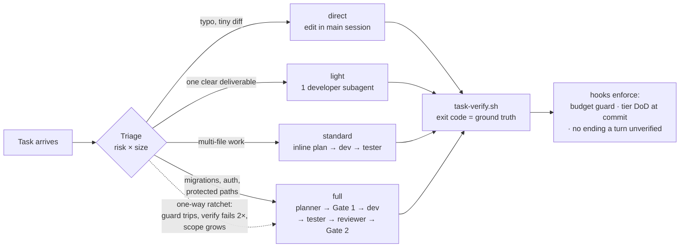

# Maestro — a tiered, gated dev harness for Claude Code

> Not every task deserves a team meeting. A boss doesn't convene the whole company to fix a typo —
> but he does call the lawyer before changing one line of a contract. Maestro makes Claude Code work
> the same way: **triage every task by risk × size, run only the process that tier needs, and make
> the safety rails impossible to talk your way past.**

100% native Claude Code — subagents, hooks, a skill, and four small shell scripts. No MCP server,
no proxy, no daemon. The whole loop runs inside the conversation where you can watch every step,
and the state lives in plain files you can `cat`.

**License:** MIT · **Status:** personal harness, shared as a portfolio piece — built and shipped
through its own gated loop (the task ledgers under `.claude/maestro/` are the receipts).

---

## The idea in one diagram



The model decides the tier (it's a judgment call). The **escalation ratchet is code** — it only
goes up, never silently down. Choosing too light a tier is harmless: the moment the diff outgrows
the budget or touches a protected path, a hook blocks and the task escalates.

## Design principles

**Prose decides, scripts record, hooks enforce.** The LLM makes judgment calls (tier, plan,
handoffs). Everything that must be *exactly right* is code:

| Concern | Mechanism |
|---|---|
| Task state | A file ledger (`.claude/maestro/<slug>/state.json` + `log.jsonl`) written only by scripts — stable schema, no drift |
| "Tests passed" | `task-verify.sh` is the **only** writer of verify records: a recorded pass means the command really exited 0, not that a model claimed it did |
| Shipping discipline | `commit-gate` hook reads the active task's tier DoD from the ledger and re-runs the verify command on every `git commit` — missing tester verdict at standard tier? Commit blocked |
| Honest endings | `stop-dod` hook blocks ending a turn with code changed after the last green verify |
| Scope creep | `guard-block-main-edits`/`-bash` hooks cap direct edits at ≤50 changed lines / 2 files (cumulative vs HEAD) and hard-block protected paths — surviving even `--dangerously-skip-permissions` |
| Tier discipline | `task-record.sh` refuses tier downgrades; a new dev round invalidates stale verdicts (they judged the old diff) |

**Goal-altitude delegation.** The orchestrator (CTO) writes each crew subagent one self-contained
GOAL handoff — goal, context with `file:line` hints, deliverables, constraints, acceptance — and
owns *what*; the subagent owns *how*. The same GOAL flows to an adversarial tester as the judged
intent, so "command exited 0" and "task actually satisfied" stay separate questions.

**Edge cases become tests, not vibes.** The known failure mode of same-family dev + judges is the
rare missed special case. So the developer contract makes edge-case enumeration mandatory
(boundary / empty / concurrent / error-path / unicode / timezone …), the applicable ones must become
executable tests, and the tester is explicitly an edge-case hunter that treats a lazy edge-case
ledger as a FAIL signal on its own.

## The tier ladder

| Tier | When | What runs | Human gates |
|---|---|---|---|
| **direct** | complete diff fits in your head, ≤50 lines / 2 files, no protected path | edit in main session | none (verify still enforced at stop/commit) |
| **light** | one clear deliverable, verify command known | 1 developer subagent → verify | none |
| **standard** | multi-file feature/bugfix | inline plan (posted, then proceed) → dev → verify → tester rounds | Gate 2 (ship) |
| **full** | protected paths, migrations, auth, public API | planner subagent → **Gate 1** → dev → verify → tester → reviewer → **Gate 2**, strict DoD | Gate 1 + Gate 2 |

**Risk beats size**: a 3-line migration edit is `full`; a 200-line new test file is `light`.

## Blind mode — tickets in a codebase you don't own

The tier ladder assumes you can judge risk. **Blind mode** covers the day-job case where you can't:
a ticket lands in a company codebase neither you nor the orchestrator deeply understands. The role
inversion: you become a **relay, not an oracle** — truth lives in the ticket, the code, the git/PR
history, and your team.

The orchestrator grounds the ticket against code and git history **before asking any human
anything** (never ask what grep can answer), routes each remaining assumption to its source of
truth (`code` / `history` / `founder` / `team`), and compresses the `team`-routed unknowns into one
paste-ready, **assume-unless-vetoed** packet — max ~5 questions ranked by cost-if-wrong, each with a
stated default, so work proceeds while answers trickle in. Received answers append to a per-repo
knowledge file that the next ticket's grounding reads first: **every ticket makes the repo less
blind**, and stabilized entries get promoted into real docs. Implementation floor is `standard` —
in unfamiliar code there is always an adversarial tester judging the diff against the ticket.

## Quickstart

Prerequisites: [Claude Code](https://claude.com/claude-code), `jq`, `python3`.

```bash
git clone https://github.com/oscarlehuu/my-claude-harness.git
cd my-claude-harness
./install.sh                 # symlink crew+hooks+skill+contract into ~/.claude (global)
# or: ./install.sh /path/to/project   for a project-local install
```

The install also links the operating contract — `AGENTS.md` (single source of truth) plus
`CLAUDE.md` (a pointer that imports it) — so every session loads it; pre-existing non-symlink
docs are left untouched. Then merge `settings.hooks.json` into your `~/.claude/settings.json`
(for a global install, use absolute hook paths — `~/.claude/hooks/...`). Open a new Claude Code
session anywhere: the contract + a SessionStart hook put it in CTO mode, and the first code task
gets a one-line triage (`Tier: light — ...`) before anything runs.

Per-repo escape hatch: `echo 1 > .claude/maestro-direct` turns the guards off for that repo.
Budget/protected-path config: `.claude/maestro-budget` (`LINES=50`, `FILES=2`,
`PROTECTED=**/auth/**:**/migrations/**`).

## Layout

```
skills/maestro/SKILL.md   the operative protocol — tier playbooks, gates, handoff contract
skills/maestro/scripts/   task-init · task-verify · task-record · task-status (the ledger)
crew/                     6 subagent roles: planner · scout · developer · ui-developer · tester · reviewer
hooks/                    guard-block-main-edits · guard-block-main-bash · commit-gate · stop-dod · crew-context · maestro-engage
tests/                    black-box suite for every script and hook — also the repo's verify command
docs/                     architecture + decision log · charter/ (gate pipeline, Definition of Done)
AGENTS.md                 project map + CTO operating contract (single source of truth)
CLAUDE.md                 pointer only — imports @AGENTS.md for Claude Code
settings.hooks.json       hooks block to merge into .claude/settings.json
install.sh                idempotent symlink deploy (global or per-project)
variants/personal/        the retired MCP-server replica — kept as a frozen reference (see below)
```

## Where this came from (the short version)

1. **pi/foreman** — the original: a deterministic gated planner→dev→test→review→ship loop on the
   [pi coding agent](https://www.npmjs.com/package/@earendil-works/pi-coding-agent), with an
   "alignment engine" (understanding layer, assumption scoring, strict DoD) layered on top.
2. **maestro-mcp** — a faithful MCP-server replica for Claude Code, verified milestone by milestone
   (M1–M7: cross-provider crew, byte-identical decision modules, loop-breaker). It worked — and got
   retired anyway: an MCP server owning the loop is a black box. You see what goes in, not what it
   does. `variants/personal/maestro-mcp/MIGRATION-STATUS.md` documents that chapter.
3. **maestro native** (this) — the same hard guarantees rebuilt on Claude Code's own primitives,
   plus the tier ladder the fixed pipeline always needed. The state machine became files + hooks;
   the loop became visible; small tasks got fast.

The deepest lesson carried through all three: **exit code is ground truth.** Judges can argue;
a non-zero exit cannot be talked into a pass.

## Verifying the harness

The enforcement chain is smoke-tested end-to-end (ledger lifecycle, one-way ratchet, tier-aware
commit blocking, stale-verdict invalidation, stop-hook loop guard):

```bash
bash hooks/test/guard_scratch_test.sh   # guard carve-outs
# the scripts are exercised live by the harness itself — open a task and watch the ledger:
~/.claude/skills/maestro/scripts/task-init.sh demo light "try the ledger" "true"
~/.claude/skills/maestro/scripts/task-verify.sh && ~/.claude/skills/maestro/scripts/task-status.sh
~/.claude/skills/maestro/scripts/task-record.sh task_done
```

## License

MIT — see [LICENSE](LICENSE).
